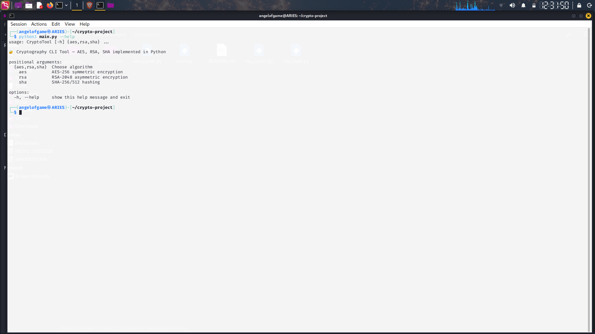
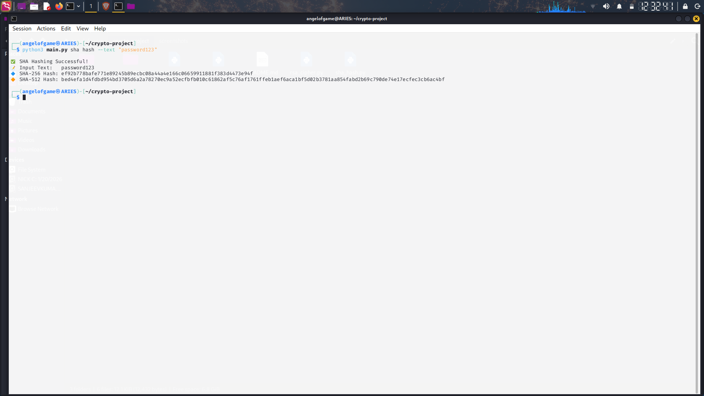
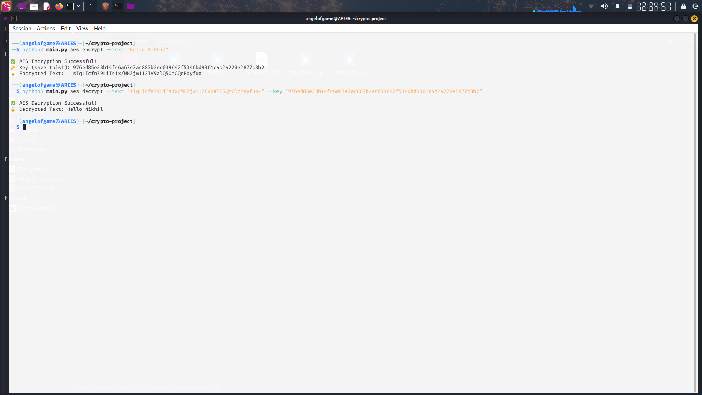
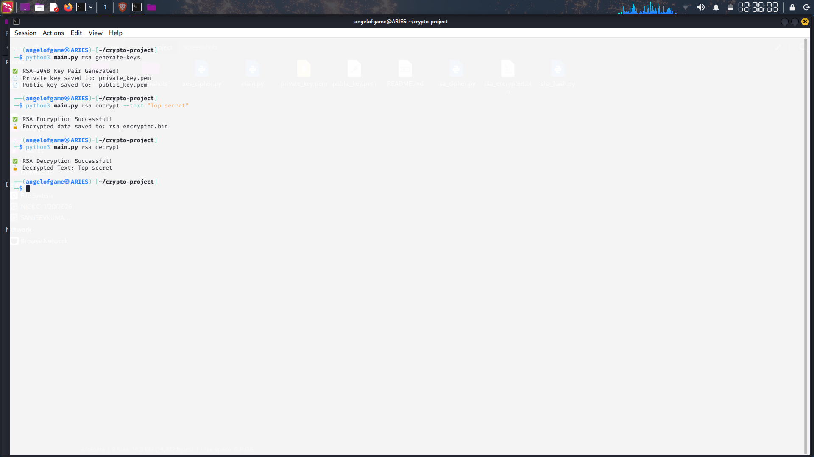

# 🔐 Cryptography Algorithms Implementation

A Python-based command-line tool implementing core cryptographic algorithms — **AES-256**, **RSA-2048**, and **SHA-256/512**.  
Built as part of a Cybersecurity Internship at **Codec Technologies** to understand encryption, decryption, and hashing from the ground up.

---

## 👤 Author
- **Name:** Nikhil Kumar Yadav  
- **GitHub:** [Nikhil2005-byte](https://github.com/Nikhil2005-byte)  
- **Internship:** Codec Technologies — Cybersecurity Intern  

---

## 🧠 Algorithms Implemented

| Algorithm | Type | Key Size | Use Case |
|-----------|------|----------|----------|
| AES-256 (CBC mode) | Symmetric Encryption | 256-bit | Fast encryption of text and files |
| RSA-2048 (OAEP) | Asymmetric Encryption | 2048-bit | Secure key exchange, digital signatures |
| SHA-256 / SHA-512 | Hashing (One-way) | — | Password hashing, file integrity verification |

---

## 📁 Project Structure

\`\`\`
crypto-project/
├── main.py          ← Unified CLI entry point (argparse)
├── aes_cipher.py    ← AES-256 CBC encryption & decryption
├── rsa_cipher.py    ← RSA-2048 key generation, encrypt & decrypt
├── sha_hash.py      ← SHA-256/512 hashing & file integrity check
├── screenshots/     ← Demo screenshots
└── README.md
\`\`\`

---

## ⚙️ Installation

\`\`\`bash
# Clone the repository
git clone https://github.com/Nikhil2005-byte/crypto-algorithms.git
cd crypto-algorithms

# Install dependency
pip3 install pycryptodome --break-system-packages
\`\`\`

---

## 🚀 Usage

### 🔷 SHA Hashing
\`\`\`bash
python3 main.py sha hash --text "password123"
python3 main.py sha hash-file --file myfile.txt
python3 main.py sha verify --file myfile.txt --hash <known_hash>
\`\`\`

### 🔒 AES-256 Encryption
\`\`\`bash
python3 main.py aes encrypt --text "Hello World"
python3 main.py aes decrypt --text "<encrypted_text>" --key "<hex_key>"
\`\`\`

### 🔑 RSA-2048 Encryption
\`\`\`bash
python3 main.py rsa generate-keys
python3 main.py rsa encrypt --text "Top secret message"
python3 main.py rsa decrypt
\`\`\`

### ❓ Help Menu
\`\`\`bash
python3 main.py --help
\`\`\`

---

## 💡 Key Concepts Learned

- **AES CBC Mode** — An IV ensures identical plaintexts produce different ciphertexts every time
- **RSA OAEP Padding** — Prevents pattern-based attacks on raw RSA encryption
- **Symmetric vs Asymmetric** — AES is fast but needs a shared key; RSA solves key distribution using a key pair
- **SHA is one-way** — Hashes cannot be reversed, ideal for password storage and file integrity
- **Avalanche Effect** — A single character change produces a completely different hash output

---

## 🛡️ Security Notes

- Private keys and encrypted files are excluded via `.gitignore`
- AES keys are randomly generated per session using `get_random_bytes(32)`
- RSA-2048 with OAEP padding is the current industry standard
- Never hardcode cryptographic keys in source code

---

## Screenshots

### Help Menu

### SHA Hashing

### AES Encryption & Decryption

### RSA Workflow

---

## 📚 Dependencies

| Package | Purpose |
|---------|---------|
| `pycryptodome` | AES and RSA cryptographic operations |
| `hashlib` | SHA hashing (Python standard library) |
| `argparse` | CLI interface (Python standard library) |
